# Anomaly Detection in Credit Card Transactions Using PyOD and Microsoft AutoML (FLAML)

## P33 Global Data Lab Weekly Report  
**Kipkemoi Vincent**  
**July 12, 2024**

---

### Introduction

Anomaly detection in financial markets plays a crucial role in identifying irregularities or outliers that deviate significantly from normal patterns, thus offering invaluable insights for risk management and fraud detection. As financial transactions grow increasingly complex and voluminous, traditional methods often struggle to cope with the scale and diversity of data generated. This is where advanced techniques such as PyOD (Python Outlier Detection) and Microsoft AutoML (FLAML) come into play.

**PyOD** provides a comprehensive suite of algorithms tailored for anomaly detection, including statistical approaches, proximity-based methods, and machine learning models like Isolation Forest and Autoencoders. These algorithms excel in detecting anomalies across various financial metrics such as transaction amounts, frequency, and temporal patterns, offering flexibility and robust performance in differentiating legitimate transactions from potentially fraudulent ones.

**Microsoft AutoML**, powered by **FLAML (Fast Lightweight AutoML)**, represents a significant leap forward in automating the machine learning pipeline for anomaly detection in financial markets. FLAML optimizes hyperparameters and selects the best model from a range of candidates, enabling efficient and accurate anomaly detection without requiring extensive manual intervention. By harnessing the power of automated machine learning, financial institutions can expedite the deployment of anomaly detection systems, enhance detection accuracy, and adapt rapidly to evolving financial landscapes.

Thus, integrating PyOD and Microsoft AutoML (FLAML) empowers financial institutions to stay ahead in detecting anomalies, mitigating risks, and safeguarding financial assets with heightened precision and efficiency.

---

### Objective

In this work, I have considered an imbalanced dataset of credit card frauds ([Kaggle Dataset](https://www.kaggle.com/datasets/mlg-ulb/creditcardfraud)) with the target labels being authentic and fraudulent and evaluated a number of PyOD and AutoML (FLAML) models in identifying transactions that are, in some sense, different from the usual, authentic transactions.

As the data is highly imbalanced, I have implemented different balancing approaches such as undersampling, oversampling and SMOTE, and used the best model to evaluate the performance under each case.

Furthermore, as opposed to using accuracy alone as the evaluation metric, I have used different evaluation metrics such as **Precision**, **Recall**, **F1-score**, and **ROC-AUC**, which are considered robust especially when dealing with imbalanced datasets.

---

### Data

The dataset contains information on the transactions made using credit cards by European cardholders, in two particular days of September 2013. It presents a total of **284,807 transactions**, of which **492 were fraudulent**. Clearly, the dataset is highly imbalanced, the positive class (fraudulent transactions) accounting for only **0.173%** of all transactions.

**Columns in the dataset are:**

- `Time`: The time (in seconds) elapsed between the transaction and the very first transaction  
- `V1` to `V28`: Obtained from principle component analysis (PCA) transformation on original features that are not available due to confidentiality  
- `Amount`: The amount of the transaction  
- `Class`: The status of the transaction with respect to authenticity. The class of an authentic (resp. fraudulent) transaction is taken to be 0  

---

### Evaluation Metrics

Let TP, TN, FP and FN respectively denote the number of true positives, true negatives, false positives and false negatives among the predictions made by a particular classification model.

Below we give the definitions of some evaluation metrics based on these four quantities:

- **Accuracy** = (TP + TN) / (TP + TN + FP + FN)  
- **Precision** = TP / (TP + FP)  
- **Recall** = TP / (TP + FN)  
- **F1-Score** = 2 × Precision × Recall / (Precision + Recall)  
- **F2-score** = 5 × TP / (5 × TP + 4 × FN + FP)  

**ROC-AUC** is a metric used to evaluate the performance of binary classification models. It measures the ability of the model to distinguish between classes by plotting the True Positive Rate (TPR) against the False Positive Rate (FPR) at various thresholds.

---

### Feature Selection

High dimensionality creates difficulties for anomaly detection. When the number of features increases, the data becomes sparse, and anomalies may be hidden by irrelevant or noisy attributes — a problem known as the **curse of dimensionality**.

To address this, I compared the distribution of each feature for both classes (fraudulent and authentic). Features with similar distributions across both classes were excluded, and only those with clearly different distributions were retained for further analysis.

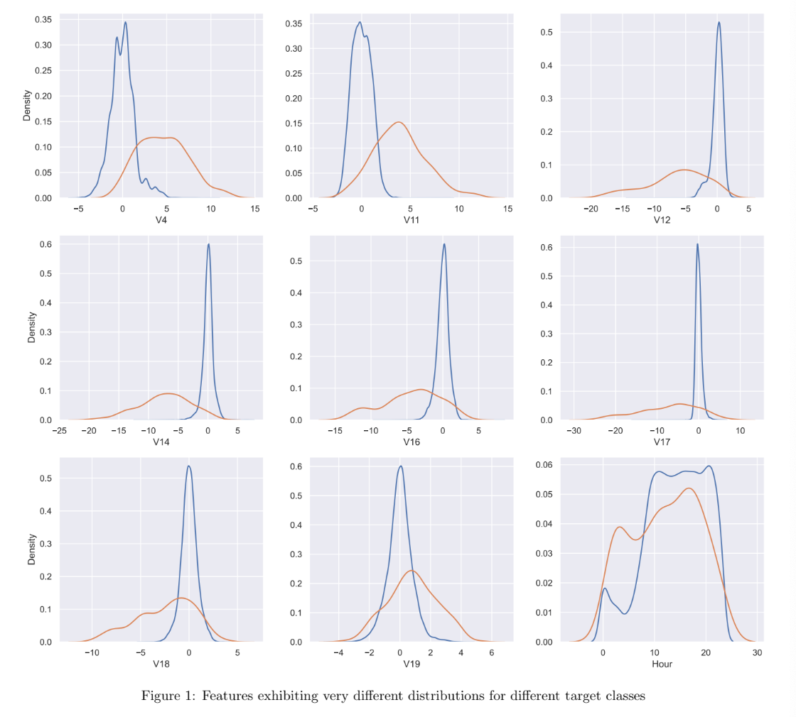

---

### Results and Discussion

Models were trained and evaluated using multiple metrics. Based on results in Figure 2, **FLAML’s ExtraTreeClassifier** emerged as the top performer:

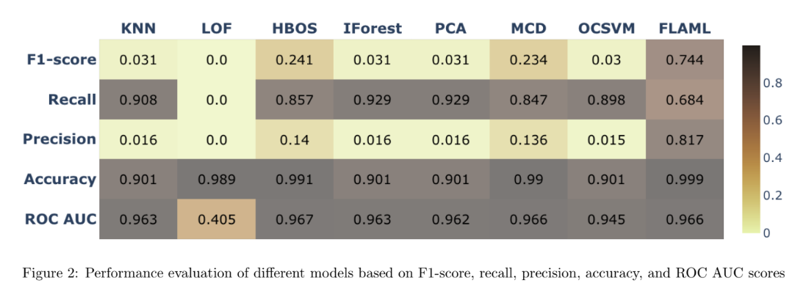

- **F1-score**: 0.744  
- **Precision**: 0.817  
- **Recall**: 0.684  
- **Accuracy**: 0.999  
- **ROC-AUC**: 0.966

Other observations:

- **LOF** had a good accuracy (0.989) but F1-score and recall of 0.0 — poor fraud detection.
- **OCSVM** had low precision (0.015).
- **HBOS**: Strong ROC-AUC (0.967), F1-score (0.241), recall (0.857).
- **IForest and MCD**: Recall > 0.8, but lower precision than FLAML.

---

### Comparison Using Balancing Methods

FLAML’s ExtraTreeClassifier was evaluated under:

| Dataset     | Accuracy | Precision | Recall | F1-score | ROC-AUC |
|-------------|----------|-----------|--------|----------|---------|
| Imbalanced  | 0.999    | 0.817     | 0.684  | 0.744    | 0.966   |
| SMOTE       | 0.999    | 0.712     | 0.857  | 0.778    | 0.947   |
| SMOTEENN    | 0.998    | 0.535     | 0.867  | 0.661    | 0.974   |

---

### Confusion Matrices

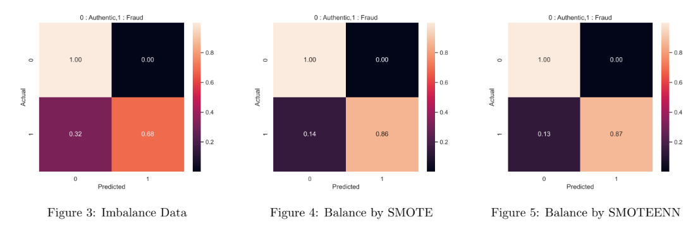

- **Imbalanced**: Excellent overall accuracy but low fraud detection (TP rate 0.32)  
- **SMOTE**: Improved recall to 0.857 (TP rate 0.86)  
- **SMOTEENN**: Highest recall (0.867), slight drop in precision

---

### Conclusion

FLAML’s ExtraTreeClassifier excels across imbalanced and balanced datasets. It maintains high accuracy (0.999), precision (0.817), and ROC-AUC (0.966) on imbalanced data. SMOTE and SMOTEENN both improve recall and F1-score at the cost of some precision.

While LOF and OCSVM struggled with detecting fraud, models like HBOS, IForest, and MCD showed promise but didn’t outperform FLAML.

Model choice depends on whether the goal is to minimize false negatives (favoring recall) or false positives (favoring precision).

---

### References

- [Credit Card Fraud Dataset – Kaggle](https://www.kaggle.com/datasets/mlg-ulb/creditcardfraud)  
- C. Molnar, *Interpretable Machine Learning*, 2019  
- J. Brownlee, *Permutation Feature Importance in Python*, 2020  
- T. Chen et al., *FLAML: A Fast Lightweight AutoML Library*, Microsoft Research  

# Interpretable Anomaly Detection in Credit Card Fraud Using LIME and SHAP

## P33 Global Data Lab Weekly Report  
**Kipkemoi Vincent**  
**July 20, 2024**

---

### Objective

In this work, I have used an imbalanced dataset of credit card frauds (with the target labels being authentic and fraudulent) to assess:

- Local and global explainability of different anomaly detectors in predicting anomalies in credit card transactions.
- Whether anomaly detectors agree on predictions, and if so, whether they give rise to similar LIME and SHAP value explanations; and what happens when they disagree.

---

### Data Description and Feature Selection

The dataset contains information on transactions made using credit cards by European cardholders, covering two days in September 2013. It presents a total of **284,807 transactions**, of which **492 were fraudulent** — meaning the dataset is highly imbalanced (fraud cases constitute only **0.173%**).

**Columns in the dataset:**

- **Time**: Seconds elapsed since the first transaction  
- **V1 to V28**: Principal components from PCA transformation (original features withheld for confidentiality)  
- **Amount**: The transaction amount  
- **Class**: Label — 0 for authentic, 1 for fraudulent

The total feature dimensionality after engineering is **34**. To enhance efficiency for SHAP and LIME explanations, I applied **Recursive Feature Elimination (RFE)**, **SelectFromModel (SFM)**, and **BorutaPy** to select the **top 10 features**.

---

### Explaining Models

To understand feature contributions, I trained six anomaly detectors:

- Logistic Regression  
- Random Forest  
- Gradient Boosting  
- LGBM Classifier  
- KNN (from PyOD)  
- Isolation Forest (from PyOD)  

Explainability was assessed from two perspectives:

- **Global explanations** (average feature impact across the dataset)  
- **Local explanations** (feature impact on a single prediction)  

White-box models like Logistic Regression and Tree-based models offer built-in explanation mechanisms (e.g., coefficients, feature importance). For complex black-box models, model-agnostic tools like **LIME** and **SHAP** were used.

---

### Model Performance Overview

Figure 1 compares models by **ROC-AUC score** and **training time**:

- **LGBM Classifier** performed best in ROC-AUC and training time.  
- KNN and Gradient Boosting had strong accuracy but longer training times.  
- **Random Forest** and **Isolation Forest** had short training durations — making them suitable for computationally intensive explanations like SHAP.

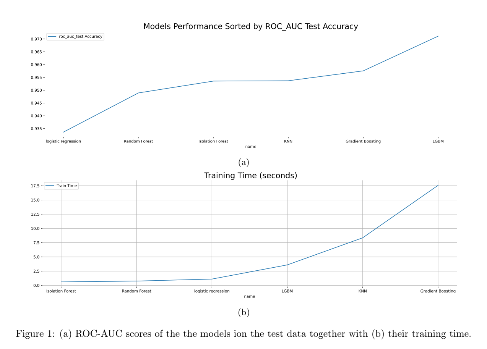

---

### Global Explanation

#### Logistic Regression Coefficients

Logistic Regression allows interpretation via feature coefficients. The magnitude and direction (positive or negative) of coefficients provide insight into global feature importance.

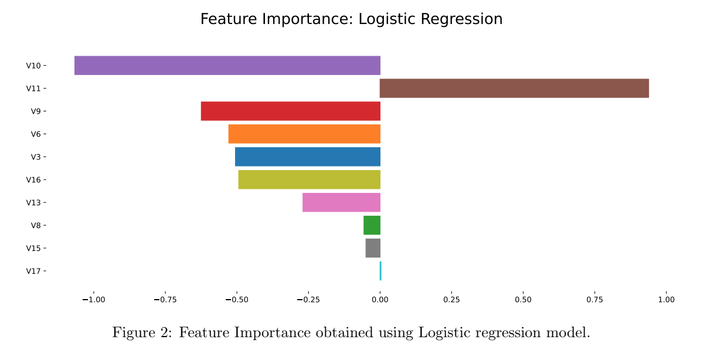

From Figure 2, feature **V10** contributes the most, while **V17** contributes the least. All features except **V11** have negative influence on predictions.

---

#### Tree-based Feature Importance vs. Permutation Importance

Tree models compute feature importance using **mean decrease in impurity** (e.g., Gini importance).  
**Permutation feature importance** shuffles individual features to measure performance drops, offering model-agnostic robustness.

- Built-in importance: Random Forest, Gradient Boosting, LGBM, Isolation Forest  
- Permutation importance: Calculated via sklearn  

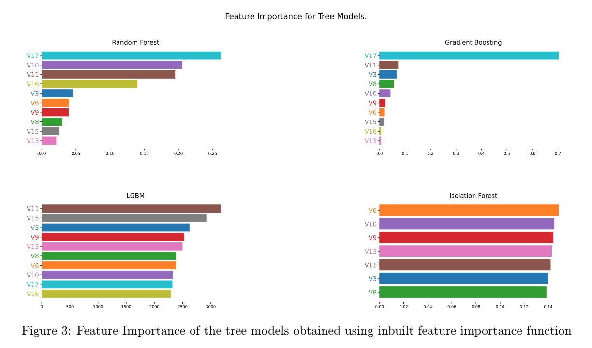  
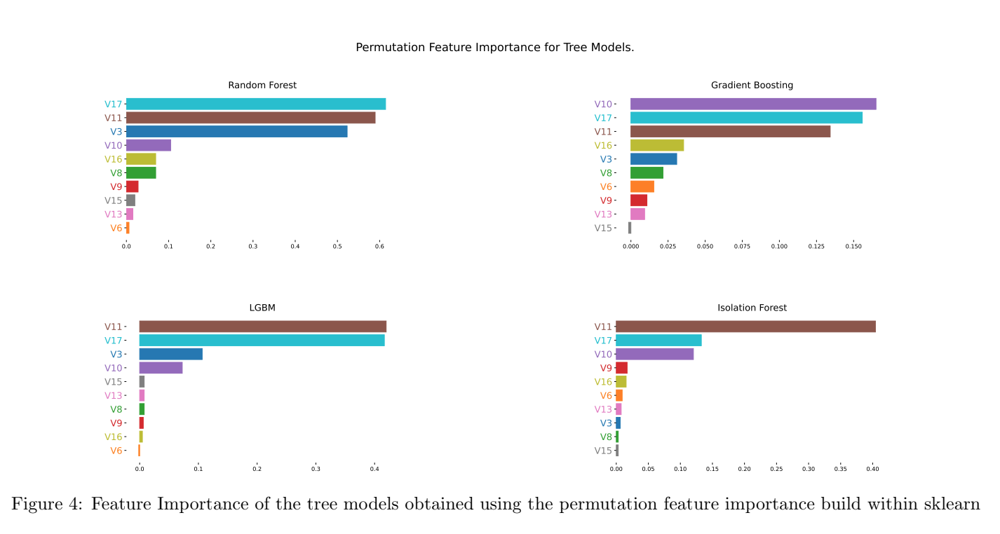

From Figure 4, features **V10**, **V11**, and **V17** consistently appear among top contributors, unlike in Figure 3. This shows permutation importance provides **more reliable and robust insights**, particularly when features are correlated or non-linear.

---

### Local Explanation

For local explanation (instance-level), I used LIME and SHAP on three cases:

1. All three models (Gradient Boosting, Isolation Forest, LGBM) agree on correct fraud prediction  
2. Only Gradient Boosting and Isolation Forest agree  
3. Only Isolation Forest and LGBM agree  

#### Case 1: All Models Agree

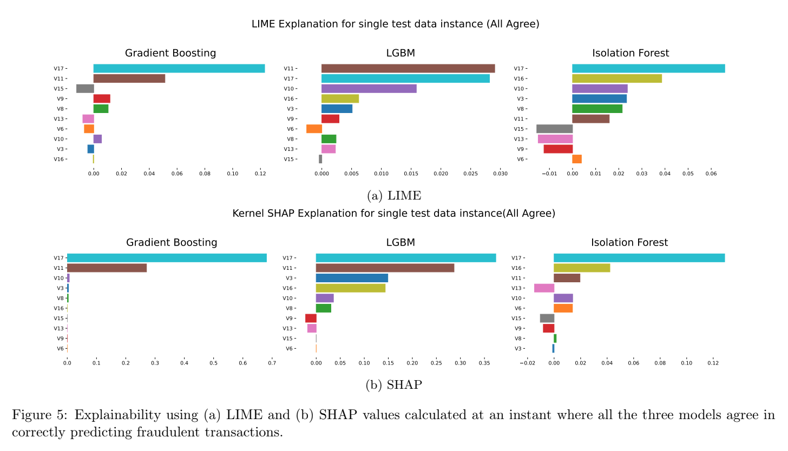  

At this instance, **V17** was a strong contributor. LIME and SHAP agreed well for Isolation Forest, but differed across Gradient Boosting and LGBM, even though all predicted correctly — indicating architectural differences in learning patterns.

---

#### Case 2: Gradient Boosting and Isolation Forest Agree

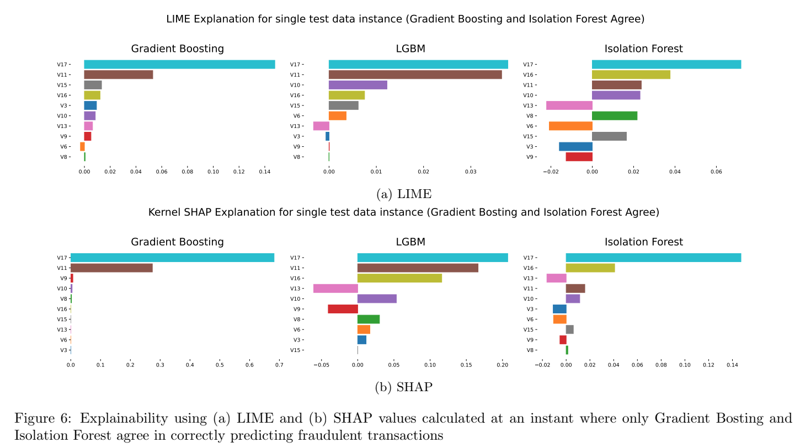  

Even though only two models agreed, **V17** remained a top contributor across explanations. The inconsistencies further reinforce how interpretability depends on model structure.

---

#### Case 3: Isolation Forest and LGBM Agree

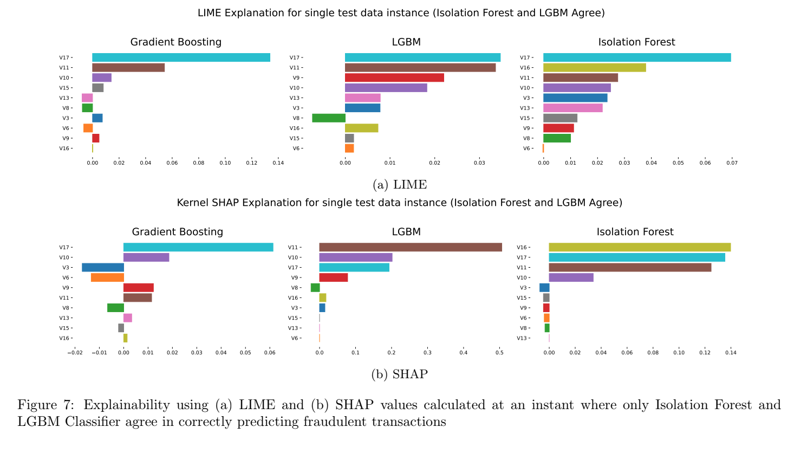  

Similar to prior cases, **V17**, **V10**, and **V13** were repeatedly identified as impactful features, confirming their importance across models and interpretability techniques.

---

### Conclusion

This study demonstrates the effectiveness of different anomaly detection models in predicting credit card fraud using an imbalanced dataset. It highlights the value of **global** and **local explainability** using LIME and SHAP, which provides actionable insights and model transparency.

Key takeaways:

- **LGBM** and **Random Forest** offer strong performance and fast training  
- **Permutation importance** offers robustness for feature selection  
- Even when predictions agree, **explanations can vary significantly** between models  

Future work can explore **ensemble or hybrid models** to balance predictive performance and interpretability.

---

### References

- M. A. Ahmed et al., “Interpretable Models for Healthcare Using Feature Importance Techniques,” *Procedia Computer Science*, 2015  
- C. Molnar, *Interpretable Machine Learning*, 2019  
- J. Brownlee, “Permutation Feature Importance in Python,” *Machine Learning Mastery*, 2020  
- S. Rashidi, “Explaining Machine Learning Models with Feature Importance,” *Towards Data Science*, 2021  
- T. V. Pham, “Explaining the LIME,” *Towards Data Science*, 2019  
- S. Sengupta, “Introduction to SHAP Values,” *Towards Data Science*, 2020

# Anomaly and Fraud Detection in Finance Using SHAP Explainers

## P33 Global Data Lab Weekly Report  
**Kipkemoi Vincent**  
**July 26, 2024**

---

### Objective

In this work, I have used two datasets: credit data and census data to evaluate and compare the computational efficiency (execution time) of 3 tree explainer algorithms:

- TreeShap algorithm built within the SHAP package  
- FastTreeShap v1 and FastTreeShap v2 algorithms built within the FastTreeShap package as defined in Lundberg, S. M., & Lee, S. I. (2017). The two algorithms are modifications of TreeShap to fully allow parallel computing.

From Lundberg, S. M., & Lee, S. I. (2017), the time complexity of a tree detector in calculating SHAP values is a function of a number of variables including the:

1. Number of samples used  
2. Number of estimators  
3. Maximum depth of each tree

Using Random Forest (RF) and Isolation Forest (IF) detectors and varying these variables, I have examined their execution times when calculating SHAP values using TreeShap, FastTreeShap v1 and FastTreeShap v2 algorithms.

Table 1 shows the description of the datasets. The number of instances in the credit transaction datasets was higher than 200,000. To make the SHAP calculations tractable in a reasonable time, I created a sub-sample of 100,000 instances for this dataset.

#### Table 1: Dataset description

| Dataset | # Instances         | # Attributes (original) | # Attributes (feature engineering) |
|---------|---------------------|--------------------------|-------------------------------------|
| Credit  | 100,000 (sub-sample)| 30                       | 34                                  |
| Census  | 48,882              | 14                       | 64                                  |

Prior to comparing the three SHAP algorithms in terms of execution times, we compared the SHAP values calculated by FastTreeShap v1 and FastTreeShap v2 against those calculated by the baseline algorithm (TreeShap), and found that the maximum difference is insignificant (lower than 10⁻⁷).

Figure 1 shows the top 3 feature rankings based on SHAP values for RF model implemented on Census data. The results show that the SHAP calculations based on TreeShap, FastTreeShap v1 and FastTreeShap v2 algorithms are similar and provide similar explainability.

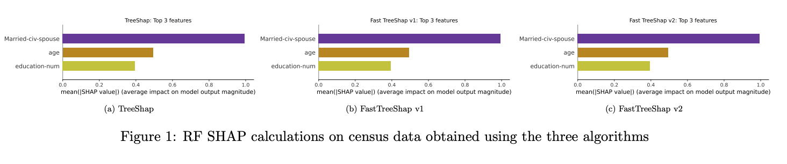

> Data Sources:  
> - [Credit Card Fraud Detection](https://www.kaggle.com/datasets/mlg-ulb/creditcardfraud)  
> - [Census Income Dataset](https://archive.ics.uci.edu/dataset/20/census+income)

---

### Varying the Number of Samples

Figure 2 shows the execution times for each of the SHAP algorithms when the number of samples is varied from 1,000 to 10,000. Note that to effect these calculations, the number of estimators is set to 100 for both models. The maximum depth parameter is set to 8 for the RF model while for IF, based on its documentation, it is already fixed at ceil(log₂(n)), where *n* is the number of samples.

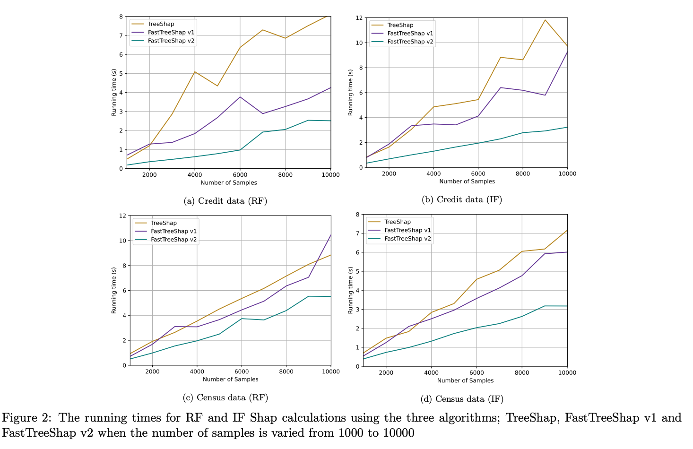

The results show that SHAP calculations via FastTreeShap v1 and FastTreeShap v2 are generally faster compared to TreeShap. The speed-up in SHAP calculations is more pronounced for FastTreeShap v2 compared to FastTreeShap v1, especially at higher sample sizes.

---

### Varying the Maximum Depth

As initially mentioned, the maximum depth of IF is fixed at ceil(log₂(n)). Here I only examined the effect of RF’s maximum depth in SHAP calculation execution for the two datasets. To do this, I have fixed the number of samples at 10,000 and set the RF number of estimators at 100.

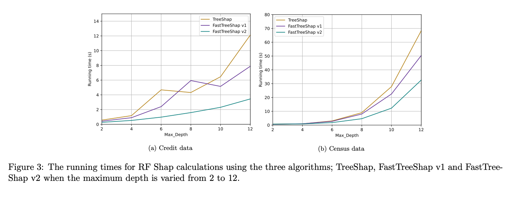

The result in Figure 3 shows that at lower values of maximum depth (<4), the difference in the execution times for the three algorithms seems to be minimal. As the values of maximum depth increase, the SHAP calculation execution times generally grow exponentially. The speed-up for FastTreeShap v2 is more pronounced than that of FastTreeShap v1, especially at higher values of maximum depth.

---

### Varying the Number of Estimators

To assess the effect of a model’s number of estimators on SHAP calculation execution time, I fixed the number of samples at 10,000 for the two models and maximum depth at 8 for the RF model.

Figure 4 shows the execution time of the three algorithms when the number of estimators for each model is varied from 40 to 200. It is worth noting that the speed-up for FastTreeShap v2 is significantly higher compared to that of FastTreeShap v1, especially when the number of estimators is set at high values.

At smaller values of number of estimators (<60), SHAP calculations using TreeShap seem to be generally faster than calculations using FastTreeShap v1. As the number of estimators increases beyond 60, however, the execution time for FastTreeShap v1 improves compared to TreeShap.

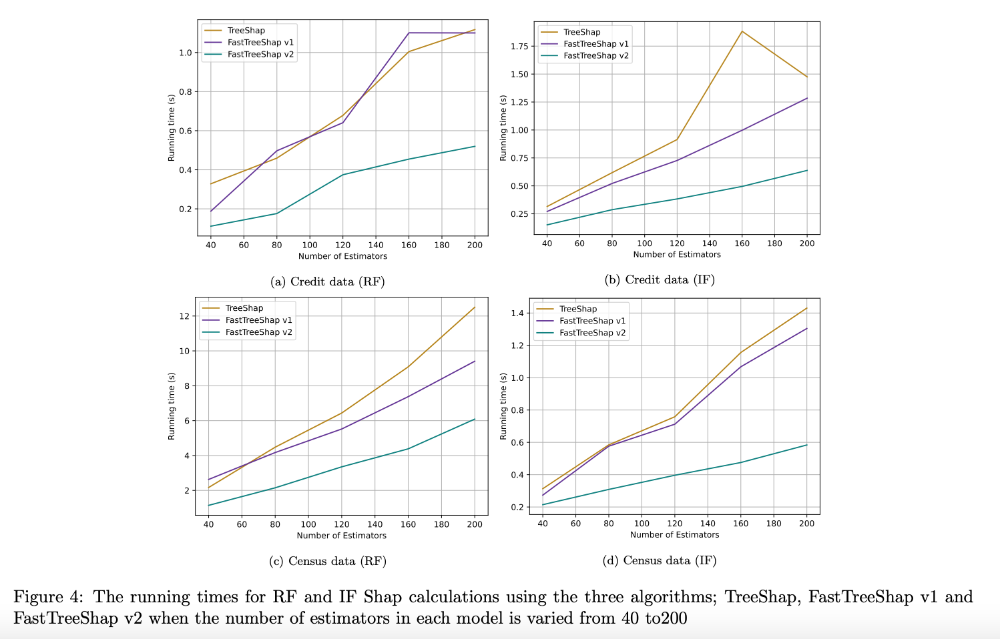

---

### Summary

Table 2 illustrates the average speed-up achieved by FastTreeShap v1 and FastTreeShap v2 in computing SHAP values for Credit and Census data. Depending on the dataset and the variable of concern, the average speed-up for FastTreeShap v1 ranges from 1.08 to 1.84, while that of FastTreeShap v2 ranges from 1.67 to 4.58.

#### Table 2: Average Speed-Up

| Dataset | Variable         | Speed-up (RF)         | Speed-up (IF)         |
|---------|------------------|------------------------|------------------------|
|         |                  | v1       | v2          | v1       | v2          |
| Credit  | No. of samples   | 1.84×    | **4.58×**   | 1.29×    | 3.15×       |
|         | Maximum depth    | 1.35×    | 3.03×       | –        | –           |
|         | No. of estimators| 1.13×    | 2.35×       | 1.29×    | 3.15×       |
| Census  | No. of samples   | 1.12×    | 1.69×       | 1.16×    | 2.07×       |
|         | Maximum depth    | 1.15×    | 1.67×       | –        | –           |
|         | No. of estimators| 1.12×    | 2.01×       | 1.08×    | 2.03×       |

---

### Conclusion

The comparison of SHAP value computation algorithms revealed that **FastTreeShap v2** significantly accelerates execution times compared to TreeShap and FastTreeShap v1.

- Achieved up to a **4.58× speed-up** on the Credit dataset  
- Up to **2.07×** on the Census dataset  
- This improvement is most notable with increased sample sizes, deeper tree depths, and more estimators

These results underscore **FastTreeShap v2’s superior efficiency**, making it highly suitable for **large-scale and complex model analyses**. Overall, FastTreeShap v2 offers substantial computational advantages, enhancing practical applicability in machine learning tasks.

---

### References

- Lundberg, S. M., & Lee, S. I. (2017). *Fast TreeSHAP: Accelerating SHAP Value Computation for Trees*. Proceedings of the 34th International Conference on Machine Learning (ICML)  
- Molnar, C. (2019). *Interpretable Machine Learning: A Guide for Making Black Box Models Explainable*  
- Sengupta. (2020). *Interpretable Machine Learning: Introduction to SHAP Values*. Towards Data Science

