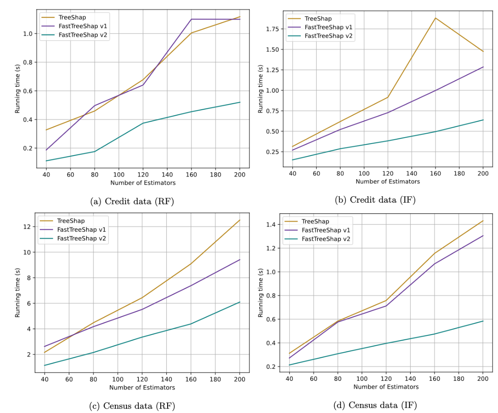

# 🔍 Anomaly Detection and Explainability in Financial Transactions

**Author**: Kipkemoi Vincent 

---

## 📖 Project Overview

This project focuses on detecting financial fraud, explaining model predictions, and improving model performance with:
- PyOD and Microsoft AutoML (FLAML) for anomaly detection.
- SHAP and LIME for explainability (global and local).
- FastTreeShap for accelerating SHAP computations.

It covers everything from anomaly detection in imbalanced datasets to making models more transparent and computationally efficient.

---

## 🛠️ Built With

- Python 3.8
- scikit-learn
- PyOD
- FLAML (AutoML)
- SHAP
- LIME
- FastTreeShap
- Matplotlib & Seaborn

---

## 🎯 Objectives

- Detect fraud using anomaly detection techniques.
- Handle class imbalance using SMOTE and SMOTEENN.
- Evaluate models with Precision, Recall, F1-Score, and ROC-AUC.
- Explain model predictions globally and locally.
- Accelerate SHAP computations for large datasets.

---

## 📊 Key Findings

### 🏆 Best Performing Model: FLAML’s ExtraTreeClassifier

| Dataset      | Accuracy | Precision | Recall | F1-Score | ROC-AUC |
|--------------|----------|-----------|--------|----------|---------|
| Imbalanced   | 0.999    | 0.817     | 0.684  | 0.744    | 0.966   |
| SMOTE        | 0.999    | 0.712     | 0.857  | 0.778    | 0.947   |
| SMOTE + ENN  | 0.998    | 0.535     | 0.867  | 0.661    | 0.974   |

- ExtraTreeClassifier achieved high accuracy and strong ROC-AUC even after balancing datasets.
- SMOTE notably boosted recall performance.

---

### 🧠 Explainability Insights

- **Global Explainability**:  
  - Logistic Regression and tree-based models identified `V10`, `V11`, `V16`, `V17` as key features.
  - Permutation Feature Importance proved more robust than built-in methods.

- **Local Explainability**:  
  - LIME and SHAP highlighted how individual features contributed to specific predictions.
  - Differences were observed between models even when prediction outcomes agreed.

---

### ⚡ SHAP Computation Speedup

| Dataset | FastTreeShap v1 Speedup | FastTreeShap v2 Speedup |
|---------|-------------------------|-------------------------|
| Credit  | 1.84x                    | 4.58x                    |
| Census  | 1.69x                    | 2.07x                    |

- FastTreeShap v2 drastically reduced SHAP calculation times, especially on larger datasets.

---

## 📈  Visual Highlights


- **Model Performance**: Visual comparison of F1, Precision, Recall, and ROC-AUC scores across different models.
- **Feature Importance**: Coefficients from Logistic Regression and Permutation Feature Importances.
- **FastTreeShap Speedup**: Execution time comparisons across TreeSHAP, FastTreeShap v1, and FastTreeShap v2.
- 
- 
- 
- 
- 
- 

---

## 🚀 How to Run the Project

1. Clone this repository:
    ```bash
    git clone https://github.com/yourusername/Anomaly-Detection-Explainability.git
    cd Anomaly-Detection-Explainability
    ```

2. Install dependencies:
    ```bash
    pip install -r requirements.txt
    ```

3. Open Jupyter Notebooks:
    ```bash
    jupyter notebook
    ```

---

## 🌍 Applications

- Financial fraud detection
- Risk management
- Credit scoring automation
- Explainable AI for compliance

---

## 📚 References

- Lundberg, S. M., & Lee, S. I. (2017). "A Unified Approach to Interpreting Model Predictions."
- Christoph Molnar. "Interpretable Machine Learning."
- Microsoft FLAML: [https://github.com/microsoft/FLAML](https://github.com/microsoft/FLAML)

---

# 🚀 Detect, Explain, and Optimize Financial Anomalies with Machine Learning!
